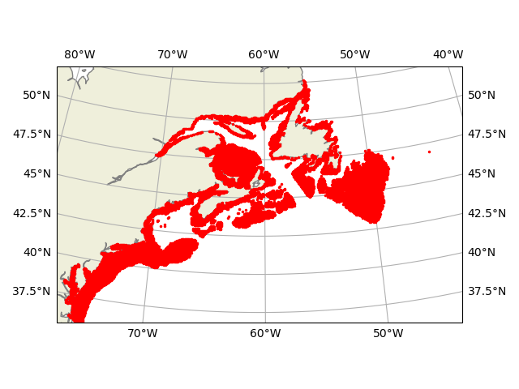

# Code and figures Pringle, Lush & Byers

Interactive figures and code for the Pringle, Lush and Byers paper "Alongshore variation in currents make some regions of the coastal ocean more vulnerable to the introduction of non-native species with planktonic dispersal." More information will appear here once the manuscript makes it through the review process and we have adjusted this page to reflect any revisions. 

**Important:** More details of the python code, and the larval connectivity data it generates, can be found in the python section of the EZfate documentation. EZfate's GitHub page can be found [here](https://github.com/JamiePringle/EZfate) and the documentation for the python version of the code can be found [here.](https://jamiepringle.github.io/EZfate/EZfate_python_guide.html)

### Interactive figure 3

The interactive version of [Figure 3 in the paper is here](https://jamiepringle.github.io/PringleLushByers_InvasibilityInRealOcean/).

### Code to replicate the results of Section "_Discussion: Comparisons with observed introductions:Carcinus maenas in the Canadian Maratimes after the mid 1980s_"

The results in this paper can be replicated for other regions of the globe, other planktonic durations and larval vertical behaviors. A guide to doing so is given below, using as an example the discussion of _Carcinus maenas_. 

The specific files are configured for the section on _Carcinus maenas_ because it is less computationally demanding to reproduce than the results for all of coastal North and South America. To configure the code for a different problem, it is important to step through this guide in order. 

#### Preparation for running code

The programs below are all written in python, and a working python environment with the `numpy`, `matplotlib`, `cartopy`, `zarr`, `xarray`, `scikit-learn`, `numba`, `s3fs`, and `tdqm` packages must be installed. If you have the miniconda python environment installed (available [here](https://www.anaconda.com/docs/getting-started/miniconda/main)), you can create and enable an appropriate environment called LSRfind with the following command:
```
conda create -n LSRfind numpy ipython matplotlib cartopy zarr xarray scikit-learn numba s3fs tqdm
conda activate LSRfind
```

When the code release in this GitHub repository (look on the right column of this page) is downloaded and uncompressed, it should create a directory named `PringleLushByers_InvasibilityInRealOcean-*`, where the * is replaced by the version of the code. Within that directory will be a directory `CodeForCarcinus` with the code described below.  the necessary empty directories that this code expects: `OSNdataDir`, `modelOutputNeutral` and `modelOutputRelativeFitness`. The programs should be run in a directory which has these directories within it. 

All of the data required to run the models has been created as part of the [EZfate project](https://github.com/JamiePringle/EZfate). It will automatically be downloaded by the included `getEZfateFromOSN.py` module.  

#### Step One: configure the "habitat" with `00_makeConnectivityMatrices_trimByDistance.py` or `00_makeConnectivityMatrices_trimByDepth.py`

The "habitat" is defined as the collection of locations where a species can exist. It is defined on the same 1/12th of a degree grid as the ocean model used to parameterize the larval dispersal, the Mercator Ocean GLORYS model. More details on the computation of the Lagrangian particle tracks, including the available choices of vertical behavior, can be found at the [EZfate project web page.](https://github.com/JamiePringle/EZfate)

In all cases, the habitat is confined to a spatial extent with a polygon defined in the variable `regionPoly`. Furthermore, you should alter the loop which defines the variable `regionName` to only include the one or more regions you will be using – this avoids unnecessarily downloading large data files. The possible regions are `theAmericas`, `AsiaPacific`, `EuropeAfricaMiddleEast` and `Antarctica` as shown in the EZfate docmentation [here.](https://jamiepringle.github.io/EZfate/03_GetData_Subset_and_Combine.html)

You must also define the depth at which the larvae are released (from 1, 10, 20 and 40m depth) with the variable `depth` and the vertical behavior of the larvae (either fixed to a depth or drifting in all three dimensions) with the variable `vertBehavior`.  You can also specify what month(s) the larvae are released in the array `inMonths`. 

If you want to define your habitat with water depth, use `00_makeConnectivityMatrices_trimByDepth.py` and define the variables `minHabDepth` and `maxHabDepth`.  The habitat below is for the _Carcinus maenas_ Latitude/Longitude region and all depths between the coast (minHabDepth=0) and 100m (maxHabDepth=100), and the red points indicate 1/12th of a degree sized patches of habitat:


If you want to define the habitat with distance from the coast, use `00_makeConnectivityMatrices_trimByDistance.py` and define the variable `gridRadius`. The example below is for the _Carcinus maenas_ Latitude/Longitude region and for all locations less than 1/6th of a degree from the coast, or two 1/12th of a degree grid spacings (`gridRadius`=2.1), and the red points indicate 1/12th of a degree sized patches of habitat:


When one or both of these codes are run, they will save connectivity data into a directory called `transposes`. This directory is created if it does not exist.  The connectivity data structures are defined [here.](https://jamiepringle.github.io/EZfate/EZfate_python_guide.html)

#### Step Two: Define the size of the introduction regions with `01_makeInitialIntroductionRanges.py`

In a perfect world with infinite computational resources, each habitat point would be analyzed individually. However, it is often more tractable to lump adjacent 1/12th of a degree habitat points together into a larger region, and then introduce novel species into the larger regions. This _does not_ affect the spatial resolution of the habitat – it only increases the size of the region into which each introduction of a novel species is made. 

There is a tradeoff involved – make the larger region too large, and spatial resolution is lost. Make it too small, and the models can take a very long time to run (especially those in which there can be a fitness difference between species). Some experimentation is required. The tradeoff in computational time and resolution are both linear – twice as many regions takes twice as long to run.

To make the regions, and save the data defining the regions into the directory `initialConditions`, all that needs to be done is to define the variable `Nclose` to the size of the region in `01_makeInitalIntroductionRanges.py`, and also define the connectivity you wish to analyze in the variable `ConnectivityModelName`, and then run `01_makeInitalIntroductionRanges.py`.  `Nclose` is the number of 1/12th of a degree patches to lump together for releases. 

For the _Carcinus maenas_ model, `Nclose` was 5, for the full North and South American domain, it was 25. 

This code takes only a few moments to run, and then displays the resulting set of regions. The regions are saved in the directory `initialConditions` with the same name as the connectivity data defined in `ConnectivityModelName`. Below, the output for the _Carcinus maenas_ run is shown for a subset of the region, with each release area shown in a different color. Note that some initial release sizes are made of up somewhat more than `Nclose` points for geometric reasons. This does not affect the results, because the number of individual introductions or initial novel species is always less than the total population of each region (the number of habitat patches in each region multiplied by the carrying capacity of each patch).


#### Step Three: The neutral model of introduction with `02_manyNeutralSpecies_fastModel.py`

_Note Well:_ The code in GitHub only runs for 100 model runs, so you can quickly test the code. Depending on the statistics of your problem, you will most likely wish to make more model runs. 

There are two codes – one for a system where all species are neutral, and one where different species can have different relative finesses, as expressed by their fecundity.  The former code, which assumes all species are neutral, runs much, much more quickly because all species can be run at once since they all interact in the same way.  It runs the model many times (here, 100 times for initial experiments with the code – but for most actual use you would want to run it more times to accurately estimate how often an introduced species persists.). Here we focus on the parameters used to configure the model; below, some code to analyze the output will be presented. 

As discussed in the paper, the main parameters to adjust in the code are 
* `nRun`, the number of model runs to make. Since the species dynamics are fundamentally stochastic, the model must be run many times to make a single result.
* `Pmax`, the maximum community carrying capacity for all species combined of each 1/12th degree patch of habitat.
* `Tmax`, the number of generations to run each model run.
* `R`, the number of larvae produced per adult that can survive long enough to settle, if it is in suitable habitat.

The output of the model runs is stored as a series of Zarr files in the directory "modelOutputNeutral" which contain the data every 100 generations for every model run as a separate file. Each file contains the latitude and longitude of every spatial point, and a matrix of the population of each species at each point in (locationIndex,speciesIndex) order. The analysis of these results are described in the next section. 

This code is optimized to run on multi-processor machines, and assumes that it should run on half as many processes as available cores – this is appropriate if your machine uses hyperthreading. If not, as is the case for Apple Silicon Machines or some newer Intel machines, please modify the section of the code which currently reads
```python
	nCPU=mp.cpu_count()//2 #for machines with hyperthreading (most intel/amd machines)
```
to 
```python
	nCPU=mp.cpu_count()    #use for machines without hyperthreading (apple silicon)
```

#### Step Four: Figuring out what the neutral model has told us with `03_analyzeWhereSurvivorsStarted_neutralModel.py` and `03_B_analyzeWhereSurvivorsStarted_neutralModel_onlyIfInIntroductionLocation.py`

`03_analyzeWhereSurvivorsStarted_neutralModel.py` calculates the fraction of introductions into each area (as defined by `01_makeInitialIntroductionRanges.py`) which persist anywhere in the domain after `Tmax` generations. `Tmax` need not just be the final generation of the model run described above, for the model also writes out output every 100 hundred generations prior to the final generation.  To specify how many model runs to include (usually, as many as you specify in step three above, but perhaps less if you want to peek at results before the model is finished), specify `nRun` in the code. To specify which model run you want to examine, you must provide the name of the connectivity data it used, and the model parameters it used – for example:
```python
#What model run are we using
ConnectivityModelName='E_CmaenasHab_depth1_minPLD40_maxPLD40_months5_to_6'; Pmax=1; Tmax=600; R=16.0; Nintro=1
```

When it is run, it will produce a map of the frequency in percent of persistence at different starting locations, which after 600 generations of species time and 100 model runs, looks like the figure below. It is important note that these colored dots indicate where the introduction occurred, and may or may not represent where the population ends up persisting. This latter data is saved, and you could easily plot it. 


Now often you are interested if a species introduced into a particular location will persist in that location, and do not care if its offspring are washed downstream and establish elsewhere. `03_B_analyzeWhereSurvivorsStarted_neutralModel_onlyIfInIntroductionLocation.py` works exactly as the last plotting code, but only includes species that persist in the introduction region where they initially started.  For the same model run, here is the plot from this code. To illustrate what can be done with this output, the analysis has been made after the model has run for only 200 generations by setting `Tmax` to 200.

#### Step Five: moving beyond neutral species dynamics with `04_twoSpeciesModel_differentR_relativeFitnessDifference.py`

Examining the introduction of species with different relative fitness is fundamentally more time-consuming, because we have to run separate introduction separately! We cannot have different favored introductions running at the same time – they would be equally favored and just neutral with each other!

As before, the model run is stochastic, so we must run all runs with all introduction locations many times to get usefull statistics. As before, the number of runs is controlled by the variable `nRun` and it is currently set to 100, but for production runs should probably be larger. 

All the parameters are as in the neutral case, except for the larval production parameter `R`. There are now two values for it – `R0` for the introduced species, and `R1` for the native species. Both can be floating point numbers.  Please read the manuscript associated with this work to see how to convert `R0` and `R1` into relative fitness. 

Note that for small differences between `R0` and `R1` it can take a long time for the introduced species to go extinct, and so the number of generations the model is run `Tmax` will often need to be much longer. Here it is 2404 generations long, instead of 600 in the neutral case. 

Even in cases with hyperthreading, it is often best to keep the number of cores used the same as the number of threads – but experiment! This is controlled by the `nCPU` variable, as in the neutral case. 

The output of the code is kept in the `modelOutputRelativeFitness` directory in a single file for each of the `nRun` model runs. Each file records how long each introduction persisted before becoming extinct (or `Tmax` if it persists), and records the final spatial distribution of the species at `Tmax` or right before it goes extinct.  Because the output of `04_twoSpeciesModel_differentR_relativeFitnessDifference.py` is written out one run at a time, the analysis code below can be used before all the runs have been completed. 

#### Step Six: analyzing runs with relative fitness with `05_analyzeWhereSurvivorsStarted_RelativeFitnessModel.py` and  `05_B_analyzeWhereSurvivorsStarted_RelativeFitnessModel_onlyIfInIntroductionLocation.py`

  These codes work the in the same manner as the equivalent codes for neutral dynamics, except you must explicitly say how many runs you are analyzing by adjusting the `nRun` variable. This decision to manually adjust `nRun` was made to allow the analysis of output from `04_twoSpeciesModel_differentR_relativeFitnessDifference.py` before it had finished all of the runs. 

  Here are figures showing where introductions into a given location lead to populations which persist anywhere (the first plot from `05_analyzeWhereSurvivorsStarted_RelativeFitnessModel.py`) and where introductions into a location lead to populations that persist at that location (the second plot, from `05_B_analyzeWhereSurvivorsStarted_RelativeFitnessModel_onlyIfInIntroductionLocation.py`).  	
  
  
  
